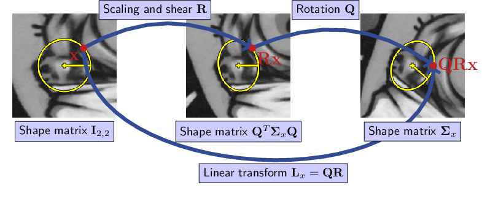

\renewcommand{\eqdef}{\overset{\textrm{def}}{=}}
\newcommand{\M}{\mathcal{M}}
\newcommand{\R}{\mathcal{R}}
\newcommand{\X}{\mathcal{X}}
\newcommand{\Y}{\mathcal{Y}}
\newcommand{\Shape}{\mathcal{S}},
\newcommand{\x}{\mathbf{x}}
\newcommand{\y}{\mathbf{y}}
\newcommand{\z}{\mathbf{z}}
\newcommand{\w}{\mathbf{w}}
\newcommand{\be}{\mathbf{e}}
\newcommand{\bo}{\mathbf{o}}
\newcommand{\bp}{\mathbf{p}}
\newcommand{\bq}{\mathbf{q}}
\newcommand{\bE}{\mathbf{E}}
\newcommand{\bL}{\mathbf{L}}
\newcommand{\bM}{\mathbf{M}}
\newcommand{\bQ}{\mathbf{Q}}
\newcommand{\bR}{\mathbf{R}}
\newcommand{\bSigma}{\mathbf{\Sigma}}
\newcommand{\bT}{\mathbf{T}}


# Normalizing Transform of a Feature

First let us observing the following proposition which relates the normalizing
transform $\bT_x$ to the feature shape $\bSigma_x$.

:::puzzle
```{proposition, name="Linear Transform and Ellipse Shape"}
Let $L$ be an invertible linear transformation in $\mathbb{R}^2$ whose matrix is
denoted by $\bL$.  For any point $\x$ in the zero-centered unit circle in
$\mathbb{R}^2$, its transformed point by $L$ is in the ellipse defined by

\begin{equation}
  \left\{
    \z \in \mathbb{R}^{2} | \z^T (\bL^{T})^{-1} \bL^{-1} \z = 1
  \right\}
\end{equation}
```
:::

```{proof}
This note provides a proof of the proposition above.

Fix a point $\begin{bmatrix} \cos(t) \\ \sin(t) \end{bmatrix}$ of
the unit circle in $\mathbb{R}^2$. Its transformed point
by $L$ is calculated as

\begin{equation}
  \begin{bmatrix} u \\ v \end{bmatrix} =
  \bL \begin{bmatrix} \cos(t) \\ \sin(t)
\end{bmatrix}.
\end{equation}

Since $\bL$ is invertible

\begin{equation}
  \bL^{-1} \begin{bmatrix} u \\ v \end{bmatrix} =
  \begin{bmatrix} \cos(t) \\ \sin(t) \end{bmatrix}
\end{equation}

The squared Euclidean norm of the equality yields

\begin{equation}
  \begin{bmatrix} u & v \end{bmatrix}
  (\bL^{-1})^T \bL^{-1} \begin{bmatrix} u \\ v \end{bmatrix} =
  %
  \begin{bmatrix} \cos(t) & \sin(t) \end{bmatrix}
  \begin{bmatrix} \cos(t) \\ \sin(t) \end{bmatrix} = 1
\end{equation}

We recognize the equation of an ellipse, which concludes the proof of
proposition.
```


## Geometric interpretation of the QR factorization

Now consider a shape matrix $\bSigma_x$. We recall that $\bSigma_x$
defines the elliptic shape $\Shape_x$. And we want to retrieve the
transformation $L_x$ that satisfies

\begin{equation}
  \bSigma_x = (\bL_x^{-1})^T \bL_x^{-1}.
  (\#eq:sigma-l)
\end{equation}

Observe from the QR factorization $\bL_x = \bQ \bR$ that $L_x$ can
be decomposed uniquely in two specific transformations $\bQ$ and
$\bR$. The upper triangular matrix $\bR$ encodes a transformation
that combines of shear and scaling transforms. The orthonormal matrix
$\bQ$ encode a rotation. This geometric interpretation is illustrated in
Figure \@ref(fig:qrd).

```{r qrd, echo=FALSE, fig.align='center', fig.cap="Geometric interpretation of the QR factorization of linear transform matrix $\\bL_x$."}

```

Unless $L_x$ involves no rotation, $\bL_x$ is an upper triangular
matrix. Then, because Equation \@ref(eq:sigma-l) is a Cholesky decomposition,
$\bL_x$ can be identified by unicity of the Cholesky decomposition.

In general, $\bL_x$ is not upper triangular. Orientations
$\bo_x$ of elliptic shape $\bSigma_x$ are provided from
feature detectors. In SIFT, $\bo_x$ corresponds to a dominant local
gradient orientation.

Thus, introducing $\theta_x \eqdef \angle \left(
\begin{bmatrix}1\\0\end{bmatrix}, \bo_x \right)$,
we have

\begin{equation}
  \bQ = \begin{bmatrix}
  \cos(\theta_x) & -\sin(\theta_x) \\
  \sin(\theta_x) &  \cos(\theta_x)
  \end{bmatrix}
\end{equation}

and expanding Equation \@ref(eq:sigma-l) yields

\begin{equation}
  \begin{aligned}
    \bSigma_x &= (\bL_x^{-1})^T \bL_x^{-1} \\
              &= \bQ (\bR^{-1})^T \bR^{-1} \bQ^{T} \quad \text{since}\ \bQ^T = \bQ^{-1}\\
    %
    \bQ^T \bSigma_x \bQ &=  (\bR^{-1})^T \bR^{-1}
  \end{aligned}
\end{equation}

We recognize the Cholesky decomposition of matrix $\bQ^T \bSigma_x \bQ$
which is the rotated ellipse as shown in Figure \@ref(fig:qrd), in which case
$\bL_x$ can be determined completely.

Finally, the affinity that maps the zero-centered unit circle to ellipse
$\Shape_x$ is of the form, in homogeneous coordinates

\begin{equation}
  \displaystyle \bT_x = \begin{bmatrix} \bL_x & \x \\ \mathbf{0}_2^T & 1 \end{bmatrix}.
\end{equation}


## Calculation of the Normalizing Transform

The algorithm below summarizes how to compute $\bT_x$.

:::demo
- Calculate the angle

  \begin{equation}
     \theta_x :=
     \mathrm{atan2}\left(
     \left\langle \bo_x, \begin{bmatrix}0\\1\end{bmatrix}\right\rangle,
     \left\langle \bo_x, \begin{bmatrix}1\\0\end{bmatrix}\right\rangle
     \right)
  \end{equation}

- Form the rotation matrix

  \begin{equation}
     \bQ := \begin{bmatrix}
     \cos(\theta_x) & -\sin(\theta_x) \\
     \sin(\theta_x) &  \cos(\theta_x)
     \end{bmatrix}
  \end{equation}

- Decompose the ellipse matrix
  $\bM := \mathrm{Cholesky}(\bQ^T \bSigma_x \bQ)$

- $\bM$ is a lower triangular matrix such that

  - $\bM \bM^T = \bQ^T \bSigma_x \bQ$
  - $\bR := (\bM^T)^{-1}$
  - $\bL := \bQ \bR$
  - $\bT_x := \begin{bmatrix} \bL & \x \\ \mathbf{0}_2^T & 1 \end{bmatrix}$
:::

### Python Implementation

Translating the pseudo-code into Python yields the following function.

```{python}
import numpy as np

def calculate_normalizing_transform(center,
                                    shape,
                                    orientation_vector):
    # Calculate the angle.
    ox, oy = orientation_vector
    theta = np.arctan2(oy, ox)

    # Form the rotation matrix.
    Q = np.array([[np.cos(theta), -np.sin(theta)],
                  [np.sin(theta),  np.cos(theta)]])

    # Decompose the ellipse matrix.
    M = np.linalg.cholesky(Q.T @ shape @ Q)

    # Extract the scale+shear tranform.
    R = np.linalg.inv(M.T)
    L = Q @ R

    T = np.zeros((3, 3))
    T[:2, :2] = L
    T[:2, 2] = center
    T[2,2] = 1

    return T
```

This code yields the following results on a synthetic data:

```{python}
center = np.array([5, 5])
shape = np.array([[   2, 0.24],
                  [0.24,    2]])
orientation_vector = np.array([1, -5])
```

The normalizing transform matrix is evaluated as follows.

```{python}
T = calculate_normalizing_transform(center,
                                    shape,
                                    orientation_vector)
print(T)
```

Check that Equation \@ref(eq:sigma-l) holds in our implementation.

```{python}
L = T[:2, :2]
Linv = np.linalg.inv(L)

# Should be close to 0.
print(np.linalg.norm(Linv.T @ Linv - shape))
```

Let us now construct a point.
```{python}
theta = 0.5  # radian
x = L @ np.array([np.cos(0.5), np.sin(0.5)])
```

We now want to check that this point is indeed a point of the ellipse defined by the
matrix `shape`.

```{python}
# Should be close to 1.
print(x.T @ shape @ x)
```

### C++ Implementation

Translating the pseudo-code in C++ yields the following function in a
quick-and-dirty manner.


```{Rcpp}
// [[Rcpp::depends(RcppEigen)]]

#include <RcppEigen.h>

// [[Rcpp::export]]
Eigen::MatrixXd calculate_normalizing_transform(
  Eigen::Map<Eigen::VectorXd> center,
  Eigen::Map<Eigen::MatrixXd> shape,
  Eigen::Map<Eigen::VectorXd> orientation_vector)
{
  // Calculate the angle.
  const auto theta = std::atan2(orientation_vector(1),
                                orientation_vector(0));

  // Form the rotation matrix.
  const Eigen::Matrix2d Q = Eigen::Rotation2Dd{theta}
      .toRotationMatrix();

  // Decompose the ellipse matrix.
  const Eigen::Matrix2d M = (Q.transpose() * shape * Q)
      .llt()
      .matrixL();

  // Extract the scale+shear tranform.
  const Eigen::Matrix2d R = M.transpose().inverse();
  const Eigen::Matrix2d L = Q * R;

  auto T = Eigen::Matrix3d{};
  T.setZero();
  T.topLeftCorner<2, 2>() = L;
  T.col(2) << center, 1;

  return T;
}
```

We can check our C++ implementation by interoperating with R:

```{r}
# The same synthetic data as in Python.
center <- matrix(c(5, 5), nrow=2)
shape <- matrix(c(   2, 0.24,
                  0.24,    2), nrow=2)
orientation_vector <- matrix(c(1, -5), nrow=2)

# Evaluate the normalizing transform by calling C++ from R.
T <- calculate_normalizing_transform(center,
                                     shape,
                                     orientation_vector)
```

Upon inspection and comparison with Python, we do retrieve the same coefficients
as in the Python implementation and this is a sufficient validation for the
purpose of this exercise.

```{r, echo=FALSE}
T
```
