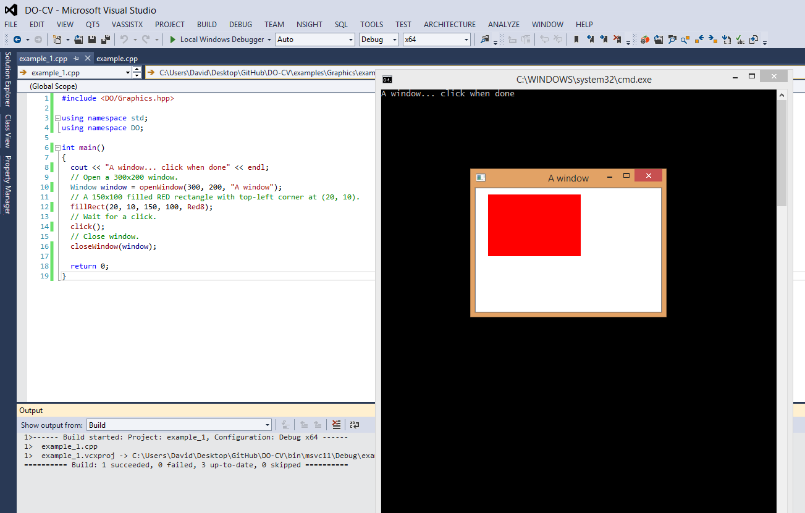

Graphics
========

Quick-start
-----------

The example below shows how to:

#. open a window,
#. draw something,
#. wait for a mouse click,
#. close the window.

.. literalinclude:: ../../../examples/Graphics/window_management_example_1.cpp
   :encoding: latin-1
   :language: cpp

You should be able to see something like below:

.. note::

   To run the code snippets below, create a file `CMakeLists.txt` and place it
   in the same folder as where the source code lives::

    cmake_minimum_required(VERSION 2.6)

    find_package(DO COMPONENTS Core Graphics REQUIRED)
    include(${DO_USE_FILE})

    add_executable(graphics_example graphics_example.cpp)
    set_target_properties(graphics_example PROPERTIES
                          COMPILE_FLAGS "-DSRCDIR=${CMAKE_CURRENT_SOURCE_DIR}"
                          COMPILE_DEFINITIONS DO_STATIC)
    target_link_libraries(${_project_name} ${DO_LIBRARIES})

   Note that the examples are also available in the `examples` directory.

Table of Contents
-----------------

.. toctree::
   graphics/window_management
   graphics/drawing_commands
   graphics/keyboard_mouse_input
   graphics/image_display
   graphics/dialog_box_example
   graphics/mesh_viewer
   graphics/interactive_viewer
   :maxdepth: 2